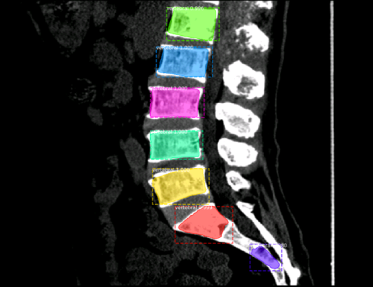

# Vertebral Segmentation

[](https://www.python.org/)
[](https://www.tensorflow.org/)
[](https://keras.io/)

The code is based on [matterport Mask RCNN](https://github.com/matterport/Mask_RCNN) (Python3, Keras and TensorFlow).

----

用六院数据做脊骨分割。

椎体位置标注文件在服务器上的位置： `/DATA/data/hyguan/liuyuan_sins/data/400例椎体位置.xlsx`

生成的json格式标签：`/DATA5_DB8/data/sqpeng/Projects/VertebralSegmentation/label.json`

voxel 在服务器上的位置：

1. `/DATA/data/hyguan/liuyuan_spine/data/spine_npy`  (249例)

2. `/DATA/data/hyguan/liuyuan_spine/data/cervical/npy`  (51例 颈椎)

3. `/DATA/data/yfli/dataset/data_01_19` (2_npy, 4_npy, 5_npy 共100例)

将所有矢状面提取出来，保存为npy文件，目录: `/DATA5_DB8/data/sqpeng/Projects/VertebralSegmentation/data`

* 错误标签

1190274, 1939444(512x2), 3101826(512x48), 3391383(512x78), 3521844c(x), 4074305

（暂时抛弃这些病人的数据，有效数据为 379 例。）

----

## Mask RCNN

 🌀 ***2018-10-30 17:28 Update***

现在的思路是：将脊骨数据处理成COCO的格式，然后试试 Mask RCNN 在医疗图像上的效果。 
 
### Training on Your Own Dataset

Start by reading this [blog post about the balloon color splash sample](https://engineering.matterport.com/splash-of-color-instance-segmentation-with-mask-r-cnn-and-tensorflow-7c761e238b46). It covers the process starting from annotating images to training to using the results in a sample application.

In summary, to train the model on your own dataset you'll need to extend two classes:

```Config```
This class contains the default configuration. Subclass it and modify the attributes you need to change.

```Dataset```
This class provides a consistent way to work with any dataset. 
***It allows you to use new datasets for training without having to change 
the code of the model.*** It also supports loading multiple datasets at the
same time, which is useful if the objects you want to detect are not 
all available in one dataset. 

See examples in `samples/shapes/train_shapes.ipynb`, `samples/coco/coco.py`, `samples/balloon/balloon.py`, and `samples/nucleus/nucleus.py`.

例子 `samples/balloon/balloon.py` 和脊骨分割问题非常相似！
 
 🌀 ***2018-10-31 15:47 Update***
 
 在自己的脊骨数据集上训练，耗时不到1h，得到训练好的模型，路径：`/DATA5_DB8/data/sqpeng/Projects/Mask-RCNN-Vertebral-Segmentation/logs/vertebral20181030T2252/mask_rcnn_vertebral_0030.h5`
 
 对模型预测以及分析参见 [inspect_vertebral_model.ipynb](https://github.com/pengshiqi/Mask-RCNN-Vertebral-Segmentation/blob/master/samples/vertebral/inspect_vertebral_model.ipynb)。
 
 效果非常棒👍！毕竟 Mask-RCNN 是 state-of-the-art ...
 
 后面要有所改进其实挺困难的... 可以有这样几个思路：
 
 1. 考虑脊骨数据的特征，脊骨基本上是分布在一条曲线上，可以对模型加上一个曲线的约束。（感觉可以一试）
 
 2. 利用 GAN 做数据增强。 （靠谱吗？宇博说训练数据太少）
 
 🌀 ***2018-11-11 16:57 Update***
  
 分割结果Demo：
 
 
 
 
  
  🌀 ***2018-11-14 10:26 Update***
  
  先去除附属器官的FP

  这里需要制定多个规则：
    
  1. 偏离拟合曲线太远的
    
  2. 在竖直方向上没有重叠的
    
  3. 保证横向没有重叠的
    
  然后再去除椎间盘的FP
    
  可以根据大小比例来判断
 